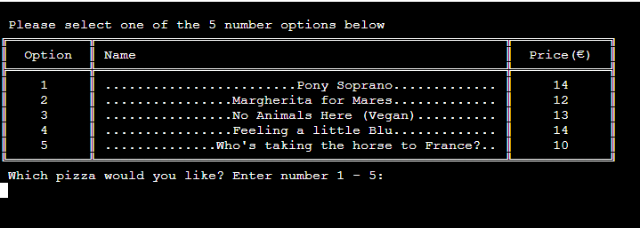
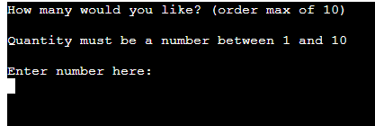
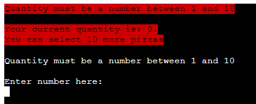
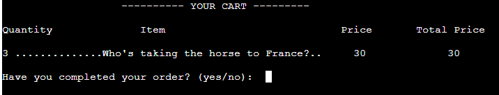
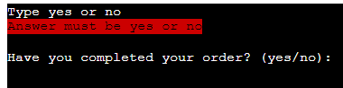
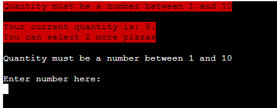
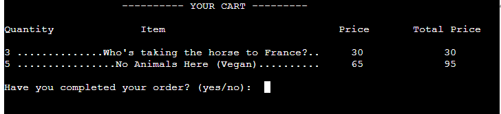
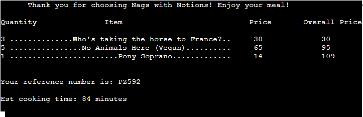
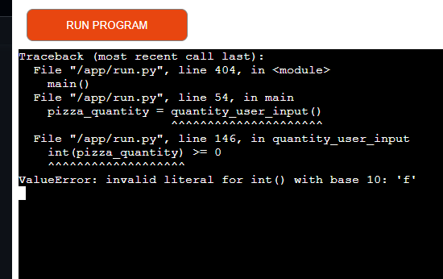

# PIZZA ORDER SYSTEM
  - [OVERVIEW](#overview)
  - [UX/UI](#uxui)
    - [STRATEGY](#strategy)
      - [Goals ](#goals)
      - [User Stories ](#user-stories)
    - [SCOPE ](#scope)
    - [STRUCTURE ](#structure)
    - [FLOWCHARTS ](#flowcharts)
    - [SURFACE/DESIGN ](#surfacedesign)
    - [EXISTING FEATURES ](#existing-features)
    - [FUTURE FEATURES ](#future-features)
  - [BUGS OR ERRORS](#bugs-or-errors)
  - [TESTING](#testing)
  - [MODULES IMPORTED](#modules-imported)
  - [DEPLOYMENT](#deployment)
    - [CREATING THE WEBSITE](#creating-the-website)
    - [DEPLOYING ON HEROKU](#deploying-on-heroku)
    - [FORK THE REPOSITORY](#fork-the-repository)
    - [CLONE THE REPOSITORY](#clone-the-repository)
  - [CREDITS](#credits)
  - [TOOLS](#tools)
  - [ACKNOWLEDGEMENTS](#acknowledgements)

## OVERVIEW 🚠

I have created a fully function pizza ordering system to meet the needs of customers for a real pizza service, Nags With Notions. You can find their website here, which I also created as part of my PP1 requirements and is now online: [Nags With Notions](nagswithnotions.ie). The main function of the system is to allow customers to purchase items through the Nags with Notions website. Additionally, order information is updated to a spreadsheet, so Nags With Notions can make more informed decisions regarding the amount of product they require and can also keep users up-to-date on what's available. The program was created entirely using Python and the intention was to keep all aspects of the design in line with the Nags with Notions style. 

The [Live Site](https://pizza-ordering-system-b873de0bec0c.herokuapp.com/) is fully accessible on Heroku. 

## UX/UI

### STRATEGY

#### Goals 🥅  

* To create a Pizza ordering system that allows users to order their pizzas online
* It should improve customer experience and reduce staff workload by not having to take phone orders.
* It will also reduce queue sizes.
* This system will increase customer satisfaction by providing a detailed confirmation of the order.
* Nags with Notions aims to increase its sales by providing customers with an online ordering system where they can see the options on offer. 

#### User Stories 📖 

* I want to be able to easily browse the menu and select the pizzas I want.
* I want to be able to see the prices of the pizzas on offer
* I want to be given a warning if I've entered something incorrectly.
* I want a cart displayed that updates the price and items, as I add to it
* I want a reference number for my order and the total price at the end.
* I want to know roughly how long I need to wait for my order. 

### SCOPE 🔭 

The following features have been planned:

* Information about the current pizzas and their prices will be taken from a 
spreadsheet and presented to the user
* Users can select any pizzas, up to a maximum of ten
* The program will display warnings if the user has chosen too many pizzas
or the input they have provided isn't correct
* The user options will be presented on-screen
* The user will be updated on their current purchases and the exact overall price
* The user will be asked to proceed to checkout or continue updating their order
* A program will estimate the likely cooking time
* The user will receive a unique receipt
* Information will be presented neatly in tables/lists

### STRUCTURE☠  

This [Project Wireframe](./assets/images/readme_images/pizza_order_system_wireframe.pdf) 
shows the overall structure of the program. It was written using Python. The terminal was
created using the Code Institute template. All the coding can be found in run.py; which is
found on my [GitHub account](https://github.com/JWalshe86).

### FLOWCHARTS 📈 

### SURFACE/DESIGN 

Each page contains information to inform the user about the pizzas on offer and let them
decide what they would like. Each page leads into the next and culminates with a final display
message showing the user's purchase, overall cost, estimated wait time, and a unique reference number.

## FEATURES

### EXISTING FEATURES

The program was designed primarily to help the user but elements can help the client [nagswithnotions](nagswithnotions.ie). To give real data to the client, the system is linked to
a Google Spreadsheet: [Pizza Order Google Spreadsheet](https://docs.google.com/spreadsheets/d/14eg7Jg65BIRgRaMwWoeuFZHibci230T1KNaDBDSYRrE/edit#gid=819050592)

 

### FUTURE FEATURES 🚀

## Technologies used 🧑‍💻
- HeroKu - Used to host and deploy website.
- The Tabulate library was used to import tabulate to create the table 
that presents the pizza menu.
- The termcolor library was used to import colored to highlight some text
- [webfx.com](https://www.webfx.com/tools/emoji-cheat-sheet/) for emoji's

## Languages used

- Python 🐍

## BUGS OR ERRORS 🐛 😵

 
## TESTING 🧪

[Pylint Actions 261023](./Pylint_actions261023.pdf)
[Pylint Actions 051123](./testing/pylint_report_051123.txt) Your code has been rated
 at 8.35/10 (previous run: 8.35/10, +0.00)
 * The global statement for 'initial screen display' has run was left in the code, despite being
<<<<<<< HEAD
 highlighted by Pylint. This is because it appears to work well and I don't know another way to prevent the screen display when the user selects they want to add more items to their order. 081123 This issue 
 was resolved by using the fact that, unlike variables, lists can be manipulated regardless of scope. A 
 list was appended after the initial function was run. Once this lists length was >0 the function didn't
 run again. 
=======
 highlighted by Pylint. This is because it appears to work well and I don't know another way to prevent the screen display when the user selects they want to add more items to their order. 
>>>>>>> 9bf492dea4518d6c28059afe302d28675f3d631a
 * The code to display the cart items: [print(*x) for x in CART_DISPLAY] has been highlighted by Pylint for not being assigned to a variable. This was temporarily ignored as it's working well and I don't know an alternative. Eventually, thanks to StackOverflow, I found a resolution by using a for loop and " ".join() mapping each item in the nested list to a string with map(). Map was used to manipulate all the items and convert each item to a string which is then joined with " " so each item can be printed on separate lines.
 * The except PizzaException as e was showing as possibly unbound, despite working. By moving the 
 PizzaException class into the global scope this issue was resolved.
 * After addressing the recommendations the Pylint report reads: Your code has been rated at 9.66/10 (previous run: 9.60/10, +0.06). It's just the above two recommendations to address. 
 * [Code Institute Pylinter 051123](./testing/Code_Institute_Pylinter_051123.pdf)
 * [Code Institute Pylinter cleared](./testing/CI_Pylinter_cleared.png)
 * Test run on Heroku 05/11/23. os.system('cls') not recognised by Heroku but os.system('clear') is. Solved with the following if statement: 'os.system('cls' if os.name=='nt' else 'clear')'. I also had to run pyfiglet to my requirement.txt, so Heroku could recognize it as a dependency.

 ### Feature Testing 061123/071123

 All tests took place on the [deployed Heroku site]((https://pizza-ordering-system-b873de0bec0c.herokuapp.com/)) 

  

Welcome Banner

    * Expected: Upon entering the site expect the Nags with Notions Banner to display in large purple writing for 3 seconds and then disappear. 
    * Outcome: displayed as expected. 

  

Menu Display

    * Expected: menu to display after the banner disappears. Expected all 5 pizzas to be displayed with their prices respectively. Expected a table with a user input option underneath. 
    * Outcome: Displayed as expected.

 

Error handling for 'display pizza option'

    * Expected red error message to arise with characters outside 1-5. Tested with 0, f, ';', and 6. The user should then be brought back to the option of entering 1-5 again.  
    * Outcome: As expected a red warning sign appeared for all the invalid entries and the user
    was brought back to the option of entering 1-5 every time. With a valid entry '2', the user was asked to input the amount of pizzas they would like. 

  

Quantity order error handling

    * Expected: red error message to arise with characters outside 1-10. Tested with -1, f, ';', and 11. The user should then be brought back to the option of entering quantity again.
    * Outcome: While it worked for -1, unexpectedly for 'f' I got a warning message in the terminal. The issue was that the exception wouldn't accept non-integers. Using the isDigit() function, by converting anything that wasn't an integer to -1, I was able to resolve this issue. 

  

Cart Display (first time)

    * Expected: cart to show correct quantity, name price, and total price. 
    * Outcome: As expected the cart displayed information correctly. 

 

 Continue order Error Handler

    * Expected: red warning message saying input must be yes or no for incorrect input. Tested 1, ';'  cat, and *. 
    * Outcome: As expected the red error msg arose for all tests.

  

 Quantity Order 2 Error Handling

    * Expected. Red warning saying how too many pizzas were ordered & the number of options the user
    has left.
    * Outcome: As expected red warning sign, stating the amount of pizzas the user can still
    choose from. 
  
  

 Cart Display 2

    Expected: Cart to display subsequent order entries with the correct total price.
    Outcome: As expected the extra orders were included in the cart and the total prices
    were correct. 

  

 Final Display 

    Expected: Upon the user clicking yes, to 'have you completed your order'; The cart shows the correct information. A receipt number and an 
    estimated wait time which relates to the number of pizzas being cooked.
    Outcome: As expected the correct cart information is shown. 
    A unique reference number is present and the estimated cooking time
    relates to the amount of pizzas being ordered.

#### User Stories Testing 

* Need: I want to be able to easily browse the menu and select the pizzas I want.
* _Outcome_: _Achieved_. _A_ _clear_ _menu_ _is_ _present_ _displaying_ _an_ _up-to-date_ _list_ _of_ _available_ _pizzas_.

* Need: I want to be able to see the prices of the pizzas on offer.
* _Outcome_: _Achieved_. _The_ _menu_ _displays_ _the_ _prices_ _adjacent_ _to_ _the_ _relevant_ _pizza_.

* Need: I want to be given a warning if I've entered something incorrectly.
* _Outcome_: _Achieved_: _Red_ _warning_ _messages_ _highlight_ _incorrect_ 
_user_ _input_ _and_ _explain_ _what_ _to_ _do_ _correctly_.

* Need: I want a cart displayed that updates the price and items, as I add to it.
* _Outcome_: _Achieved_: _Cart_ _updates_ _with_ _correct_ _information_, 
_as_ _user_ _adds_ _items_. _The_ _overall_ _total_ _is_ _correct_. 

* Need: I want a reference number for my order and the total price at the end.
* _Outcome_: _Achieved_. _A_ _unique_ _reference_ _number_ _is_ _displayed_ _for_ 
_every_ _order_.

* Need: I want to know roughly how long I need to wait for my order.
* _Outcome_: _Achieved_. _The_ _estimated_ _wait_ _time_ _relates_
 _to_ _the_ _quantity_ _of_ _pizzas_ _being_ _ordered_. 

## MODULES IMPORTED 👽

 * The os module was used for its ability to manipulate the operating system, particularly to clear
 the terminal screen. 
 * The time module was used to complement the os module and delay when items were displayed or 
 lengthen the time an item was displayed.
 * The random module was used to present a random number that could be used for the reference.
 * The Gspread module was used to manipulate Google Sheets.
 * The pyfiglet module was imported to style the Nags with Notions banner. 

## DEPLOYMENT 🚀

### CREATING THE WEBSITE
I have used the [Code Institute Python Essentials Template](https://github.com/Code-Institute-Org/python-essentials-template) to create a terminal where my Python code will generate its output.

  
### DEPLOYING ON HEROKU

- Install Gspread using pip install Gspread in the terminal
- Ensure the requirement.txt file in the virtual working environment contains Gspread
- Enter [Heroku](https://id.heroku.com/login) and click 'Create new App'.
- Store sensitive data contained in the creds.json file in the config/Environment Vars
- Add both Python and node.js buildpacksClick Deploy and then connect to GitHub
- Search and connect to the GitHub repository name
- Click deploy branch
- When the project has been successfully deployed, click view.

### FORK THE REPOSITORY 🍴

If you would like to contribute to the project. You can:
1. Open the pizza ordering system repository on my account and 
press the fork button on the top right of the screen.
2. Click create a new fork.
3. Navigate to your fork of the original repository.
4. Copy the URL for the repository.
5. Type git clone into your terminal and paste the repository.
6. You can then create a pull request which I will review. 

### CLONE THE REPOSITORY ©

You can clone the repository to use locally by following these steps:
1. Navigate to the GitHub Repository you want to clone
2. Click on the code drop-down button
3. Click on HTTPS
4. Copy the repository link to the clipboard
5. Open your IDE of choice (git must be installed for the next steps)
6. Type git clone copied-git-url into the IDE terminal

The project will now be cloned locally for you to use.

## CREDITS 💛

* Readme template adapted from [useriasminna](https://github.com/useriasminna/american_pizza_order_system/blob/main/README.md)
* Inspiration for the large title heading from [Laura Mayock](https://github.com/LauraMayock/)
* Manipulating Google Sheets [Gspread](https://docs.Gspread.org/en/latest/user-guide.html)
* Try catch with loop [Paul Miskew](https://youtu.be/b0q9vVgAMq8?si=U_UnqDxHyZegVnsX)
* [How to pass data between functions](https://www.youtube.com/watch?v=GsKDtSHRHdI) this video was used as a means to get over the issue of wishing to pass data to one function from 2 different functions
* [Print two lists side by side on Stackoverflow ](https://stackoverflow.com/questions/48053979/print-2-lists-side-by-side)
* [How to flatten a list from bobbyhadz blog](https://bobbyhadz.com/blog/python-remove-square-brackets-from-list)
* [Switching keys and values in a dictionary from Stackoverflow](https://stackoverflow.com/questions/8305518/switching-keys-and-values-in-a-dictionary-in-python)

## TOOLS 🧰

* [Balsamiq Wireframes](https://balsamiq.com/wireframes/) were used to create a wireframe.
* [GitHub](https://GitHub.com/) - used for hosting the source code of the program
* [Google Drive API](https://developers.google.com/drive/api)- to develop apps that integrate with Drive
* [Google Sheets API](https://developers.google.com/sheets/api/guides/concepts) - to read and modify Google Sheets data
* [Google Auth](https://developers.google.com/identity/protocols/oauth2) - allows access to Google APIs
* [Gspread](https://docs.Gspread.org/en/v5.10.0/) - Python API for Google Sheets
* [Lucid Chart](https://www.lucidchart.com/pages/landing?utm_source=google&utm_medium=cpc&utm_campaign) - to create a flow chart outlining the project.
* [Code Institute Pylinter](https://pep8ci.herokuapp.com/)

## ACKNOWLEDGEMENTS 👏

* I would like to thank my family for supporting me on this journey
* Thank you Code Institute for this course
* Special thanks to the government for funding my course
* Special thanks to Iris Smok for the weekly meetings. Iris also recommended
that I consider doing something like this pizza ordering system, as it complemented
my first project, which was also on pizzas. 
* Shout out to my colleagues for their feedback and support
* Also special thanks to all those who contributed to Slack and Stackoverflow 
and those who explained coding content on Youtube. 