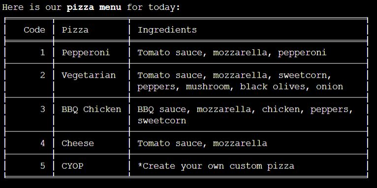

# TESTING
Testing was divided into three sections:
  - [VALIDATORS TESTING](#validators-testing)
  - [USER STORIES TESTING](#user-stories-testing)
  - [FEATURES TESTING](#features-testing)

## VALIDATORS TESTING  
### PEP8 Validator
I tested my Python code and there are no errors.

### HTML Validator
Because I added some elements in the layout.html file I tested my code for errors.

### CSS Validator
The whole website was tested and its free from errors in CSS.

### Lighthouse 
I generated a lighthouse report to check my performance and the scores are good. The lower score for the SEO is caused by the lack of meta description.

## USER STORIES TESTING
<b>User Story: </b>As a user, I want to see information about the pizza options that the restaurant offer 
<b>Outcome: </b> All the necessary information for completing an order is displayed to the user in tables. The data is pulled from the Google spreadsheet where the menu and prices are updated manually by the owner of the restaurant. There are available for the clients, tables with the menu of the day, sizes available, prices and for custom pizza, the client can choose from a range of ingredients available. This user story is accomplished because the clients have all the necessary information at their disposal.   
<b>User Story: </b>As a user, I want to be able to create my own custom pizza 
<b>Outcome: </b>Every client can choose from a range of pizza types or create his own custom pizza by entering "5" in the first-page input place. What this action does is add three more extra steps to the process of ordering, for choosing the sauce, cheese and toppings for the custom pizza. This user story was tested and fulfilled. All the steps are coming in order, logically, and the custom pizza is added to the order with a full description for the cook to see it.   
<b>User Story: </b>As a user, I want to be able to add more types of pizzas to my order 
<b>Outcome: </b>At the end of the order process, the client is given the option to add more pizza types to the order by entering "A" on the order overview page. This action will redirect the user to the first page of the order, with the current pizza menu, and will guide him through the whole process again.  
This action can be done as many times as the client wishes. 
All the food that is added will be visible in the overview for the client to decide if he wants to add more or finish the order. After processing the order, a total description of all the food that was added will be inserted into the Google Spreadsheet. 
This user story is accomplished  
<b>User Story: </b>As a user, I want to see the content of my order when deciding to add more food. 
<b>Outcome: </b>Apart from the overview that is displayed to the user at the end of the ordering process, on the first page there is available for the clients the option to look once more through the content of their orders because there is no other option of going back to the overview. 
By entering "P", a list with the pizza's quantity, name and ingredients by case will be visible to the clients that already added something in their "shopping cart" and a suggestive string otherwise. 
The clients' need for being able to see their order content for making their decision of buying easier was identified and this user story was respected.  
<b>User Story: </b>As a user, I want to be able to choose the quantity for each pizza 
<b>Outcome: </b>As a final step, any client can add a quantity between 1 and 10 for each pizza type they added. This value will be memorised and added to the description of the order. Also, this value is taken into consideration when calculating the price and the order's duration. 
This user story was tested and is accomplished because it also helped at reducing the number of steps for the client and make his buying experience better.  
<b>User Story: </b>As a user, I want to see information about the total price and duration of the order 
<b>Outcome: </b>For an order to be complete, I identified the need of seeing details about price and duration, to help the customers make the best decision when ordering, and to reduce the risk of unpaid orders because of unsatisfied clients. 
The price is visible to the user before making the final decision of finishing the order, to give him the chance of making changes to it if he wants to. After the order is processed, an estimated time for the whole order to be ready is displayed. 
After many tests, it resulted that these values are correctly calculated and they contributed to accomplishing this user story.  
<b>User Story: </b>As a user, I want to be assigned a code for my order 
<b>Outcome: </b>It is essential for the client to identify his order and this user story was accomplished by assigning a number of reference for each order. I considered that this option would be more suitable than requesting personal data like name, phone number and others. 
This number is what makes the client and the cookers recognise the order and it is used as a reference when checking its status. At the end of every order, this unique code is displayed to the user in blue colour to make it more visible  
<b>User Story: </b>As a user, I want to check my order status 
<b>Outcome: </b>The program was implemented to satisfy these clients' need for improving their experience with American Pizza restaurant. 
In the final menu, any client can choose to see the status of the order by entering "L". A table with orders code references appear with values from the Google spreadsheet and it separates them into two columns, "Preparing" and "Ready". The statuses are updated every time this request is made by any client and can also be changed manually in the spreadsheet, by a cooker or by any authorized staff. This helps maintain a real-time status for each order. This user story was tested and successfully accomplished.  

## FEATURES TESTING

* <b>Real time informations requested from the Google SpreadSheet</b> 
  -This feature was tested by comparing the output from the terminal with the content that exists at that moment in the corresponding worksheet.  
    
      
  -Also, this was tested by changing values in the worksheet and the terminal prints the coresponding content.   
    
    

* <b>Input validation at every step</b> 
  I have implemented the <code>validate_data()</code> method that is called at every step in the ordering process for validating the input of the user. This method can be adapted to any kind of requirements for the user's input by changing the values of its parameters. 
  The <code>values</code> paremeter gets the list with the user's entered values, <code>list_to_check</code> is for setting the values that are accepted as a response and <code>number_of_values_required</code> is the number of values requested.  
  This feature was tested by simulating the client's different entered values to see what is the output.  

  -The user enters a values that doesn't respect the format. 
    <b>Prameters values:</b> <code>values</code> = ["1"], <code>list_to_check</code> = ["S", "M", "L", "B"], <code>number_of_values_required</code> = 1 
    <b>Output:</b> 
      
  -In most cases only one value is accepted. Here the client inserts more than 1 value. 
    <b>Prameters values:</b> <code>values</code> = ["S", "M", "L", "1"], <code>list_to_check</code> = ["S", "M", "L", "B"], <code>number_of_values_required</code> = 1 
    <b>Output:</b> 
      
  -At the "Topings" step, the client cannot choose more than five values. In this case there were more than five values inserted. 
    <b>Prameters values:</b> <code>values</code> = ["1", "2", "3", "4", "5", "6"], <code>list_to_check</code> = ["1", "2", "3", "4", "5", "6", "7", "8", "9", "10", "B", "R"], <code>number_of_values_required</code> = 5 
    <b>Output:</b>  
      
  -For the case were the user's input is valid, a sugestive message is displayed to tell him the process continues. I decided to not make the input case sensitive for an easier experience. 
    <b>Prameters values:</b> <code>values</code> = ["S"], <code>list_to_check</code> = ["S", "M", "L", "B"], <code>number_of_values_required</code> = 1 
    <b>Output:</b>  
    
    

* <b>Order overview</b> 
  In my Python code, a <code>PizzaOrder</code> object is created after choosing the quantity for a pizza type. This object is added to <code>orders_list</code> and every other object that is created after choosing to add more to the same order. That means that all the pizzas of a client's order can be found in that list. If the client wishes to restart the order the list is emptied.
  This is how the client can see an overview of his order before it is finished. 
  -I tested this feature to see if the overview of the end of the orders corresponds with my chosen options.  
  These are my options: 
    
    
      
  -This is the overview at the end of the ordering process: 
       
  -If I enter "A" to add to my order I am redirected to the Menu page. Here I can check my order content if I insert "P". The content coresponds with what I have chosen. 
        
  -If I would have entered "R" for restarting order, instead of "A", the output would have been as it follows: 
        

* <b>Total price</b> 
  Before finishing the order, the client can see the total price of it. The unit prices are taken from the list of sizes for pizzas. For every order, the total price is calculated by summing all the prices values resulting from the multiplication of quantity with the corresponding unit price. 
  I manually tested this feature to check the resulted values and they are correct.
    
    

* <b>Order Reference</b> 
  Every client gets an order reference after completing it. This is represented by a code generated with the <code>generate_order_refference()</code> method. What is very important is for the code to be unique and that's why every random number that it's generated it's after compared with all the codes values that already exist in the spreadsheet to avoid duplicates. 
  This feature was tested to see if the reference for each order is unique and it passed.
    
    

* <b>Estimated time</b>
  This value is calculated by <code>get_total_duration()</code> method which multiply the quantity with each pizza's time for preparation and adds 15 minutes for the oven cooking and another 10 minutes for each extra pizza over the quantity of 10. The time for preparation can be found in the Sizes workseeht. 
  I have developed this algorithm trying to simulate a real life context in which the restaurant's oven has a capacity of ten pizzas at a time. 
  This feature was manually tested and it works properly (4 * 7 + 15 = 43). 
    
    
    

* <b>Orders Worksheet update</b> 
  Every time the client enters "F" for finish the order, <code>update_orders()</code> method is called. 
  This feature successfully passed. 
    

* <b>Check Live Orders Status</b>
 This feature gives the client the possibility to check his order status by relating to his given reference value. Every time a client enters "L" for checking orders status, <code>update_order_status()</code> method is called first then a table is displayed. 
 For testing this features I represented how <code>update_order_status()</code> works and how the values from the table are printed.  
  -Considering this was the current date and time when the request for the orders status has been made by entering "L" in the terminal : 
      
  -The initial state of the spreadsheet was this :   
      
  -After <code>update_order_status()</code> method was called the orders' states changed after the next formula:
  <b>All the orders that overcome the time of ordering plus duration get a status of "Ready" and the ones which overcomes with more than three hours get a status of "Finished", assuming that every order is initially set to "Preparing" </b>     
      
  -The resulted table only displays the refferences for "Preparing" and "Ready" status  
    